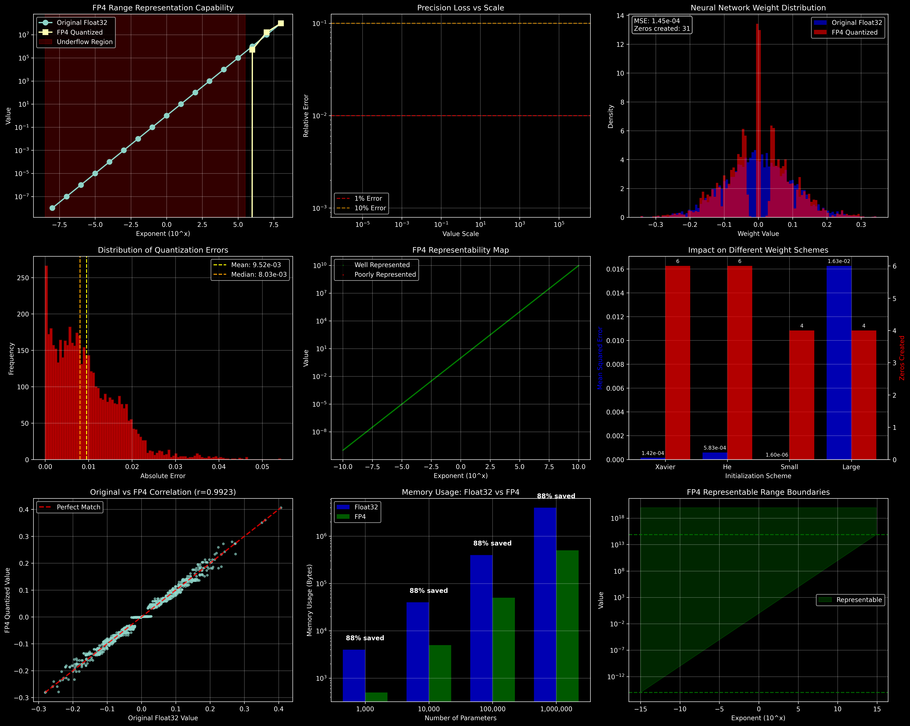

# FP4 Quantization: A Comprehensive Visual Analysis Tutorial

This tutorial provides a step-by-step analysis of FP4 (4-bit floating point) quantization using visual charts to understand its behavior, limitations, and practical implications for neural networks.



## Overview

FP4 quantization reduces memory usage by 87.5% compared to Float32, but comes with precision trade-offs. This analysis explores nine key aspects of FP4 behavior through visual charts.

## Prerequisites

Before running the analysis, ensure you have the required dependencies:

```bash
pip install torch bitsandbytes numpy matplotlib
```

## Step-by-Step Analysis

### Step 1: Range Representation Capability (Chart 1)

**What it shows:** How FP4 handles values across different orders of magnitude (10^-8 to 10^8).

**Key insights:**
- **Underflow region (red):** Values too small become zero
- **Overflow region (orange):** Values too large become infinity
- **Safe range:** Approximately 10^-6 to 10^6 for reliable representation

**Code explanation:**
```python
# Test values across different exponents
exponents = np.arange(-8, 9, 1)
test_values = torch.tensor([10.0**exp for exp in exponents])
quantized, state = bnb.quantize_fp4(test_values)
dequantized = bnb.dequantize_fp4(quantized, state)
```

### Step 2: Precision Loss Analysis (Chart 2)

**What it shows:** Relative error as a function of value scale.

**Key insights:**
- Precision loss increases dramatically at extreme scales
- 1% error threshold (red line) shows acceptable range
- 10% error threshold (orange line) shows problematic regions

**Practical implication:** Neural network weights should be initialized within the safe range.

### Step 3: Neural Network Weight Distribution (Chart 3)

**What it shows:** How typical neural network weights (Gaussian distribution, σ=0.1) are affected by FP4 quantization.

**Key insights:**
- Original distribution (blue) vs quantized (red)
- MSE shows overall error magnitude
- "Zeros created" indicates how many weights become exactly zero

**Why this matters:** Zero weights effectively remove connections in the network.

### Step 4: Error Distribution Analysis (Chart 4)

**What it shows:** Histogram of absolute quantization errors.

**Key insights:**
- Most errors are small (good news)
- Mean vs median error shows distribution skew
- Long tail indicates some catastrophic errors exist

**Interpretation:** While most weights quantize well, outliers can cause significant issues.

### Step 5: Representability Map (Chart 5)

**What it shows:** Which values can be well-represented (green) vs poorly represented (red) in FP4.

**Key insights:**
- Clear boundaries between representable and non-representable regions
- Values with <50% error are considered "well represented"
- Visual confirmation of safe operating ranges

**Usage:** Use this to validate your model's weight ranges before quantization.

### Step 6: Impact on Different Initialization Schemes (Chart 6)

**What it shows:** How different weight initialization methods fare with FP4 quantization.

**Tested schemes:**
- **Xavier:** Standard initialization (σ=0.1)
- **He:** Slightly larger initialization (σ=0.2)
- **Small:** Conservative initialization (σ=0.01)
- **Large:** Aggressive initialization (σ=1.0)

**Key insights:**
- Blue bars: Mean Squared Error for each scheme
- Red bars: Number of zeros created
- Large initialization suffers most from quantization

### Step 7: Correlation Analysis (Chart 7)

**What it shows:** Scatter plot comparing original vs quantized values with correlation coefficient.

**Key insights:**
- Perfect correlation would lie on the red diagonal line
- High correlation (r≈0.99) indicates good preservation of relationships
- Deviations from diagonal show quantization artifacts

**Practical use:** High correlation suggests model behavior should be largely preserved.

### Step 8: Memory Usage Comparison (Chart 8)

**What it shows:** Memory savings achieved with FP4 vs Float32 across different model sizes.

**Key insights:**
- Logarithmic scale shows dramatic memory reduction
- 87.5% memory savings consistently achieved
- Savings become more significant with larger models

**Real-world impact:** Enables training/inference of larger models on limited hardware.

### Step 9: Range Boundaries Visualization (Chart 9)

**What it shows:** Visual map of FP4's representable range boundaries.

**Color coding:**
- **Red:** Underflow region (values become 0)
- **Green:** Representable range
- **Orange:** Overflow region (values become ∞)

**Key insights:**
- Clear visualization of safe operating range
- Boundary lines show exact limits
- Helps in setting appropriate weight initialization scales

## Running the Analysis

To generate your own analysis:

1. **Save the Python script** as `fp4_visual_analysis.py`

2. **Run the analysis:**
```bash
python fp4_visual_analysis.py
```

3. **Expected output:**
- Console output with key insights
- Generated PNG file: `fp4_comprehensive_analysis.png`
- 9 comprehensive charts in a 3x3 grid

## Key Takeaways

### ✅ Advantages of FP4:
- **87.5% memory reduction** compared to Float32
- **Good correlation preservation** in typical ranges
- **Most neural network weights** quantize acceptably

### ⚠️ Limitations to Consider:
- **Narrow representable range** (~10^-6 to 10^6)
- **Precision loss** at extreme scales
- **Some weights become zero**, potentially removing connections
- **Catastrophic errors** for outlier values

### 🎯 Best Practices:
1. **Initialize weights conservatively** (small standard deviation)
2. **Monitor weight distributions** during training
3. **Use gradient clipping** to prevent extreme values
4. **Consider mixed precision** for critical layers
5. **Validate model performance** after quantization

## Advanced Usage

### Customizing the Analysis

You can modify the script to analyze your specific use case:

```python
# Test your own weight distribution
your_weights = torch.load('your_model_weights.pt')
quantized, state = bnb.quantize_fp4(your_weights)
dequantized = bnb.dequantize_fp4(quantized, state)

# Analyze the results
mse = torch.mean((your_weights - dequantized) ** 2)
correlation = torch.corrcoef(your_weights.flatten(), dequantized.flatten())[0, 1]
```

### Integration with Training

```python
# During training, monitor weight ranges
def check_weight_ranges(model):
    for name, param in model.named_parameters():
        if param.requires_grad:
            min_val, max_val = param.data.min(), param.data.max()
            print(f"{name}: range [{min_val:.2e}, {max_val:.2e}]")
            
            # Warn if outside safe FP4 range
            if min_val < 1e-6 or max_val > 1e6:
                print(f"⚠️  {name} may have FP4 quantization issues!")
```

## Conclusion

FP4 quantization offers significant memory savings but requires careful consideration of weight ranges and initialization strategies. Use this visual analysis to understand the trade-offs and optimize your quantization strategy for your specific use case.

The comprehensive charts provide both theoretical understanding and practical guidance for implementing FP4 quantization in production neural networks.