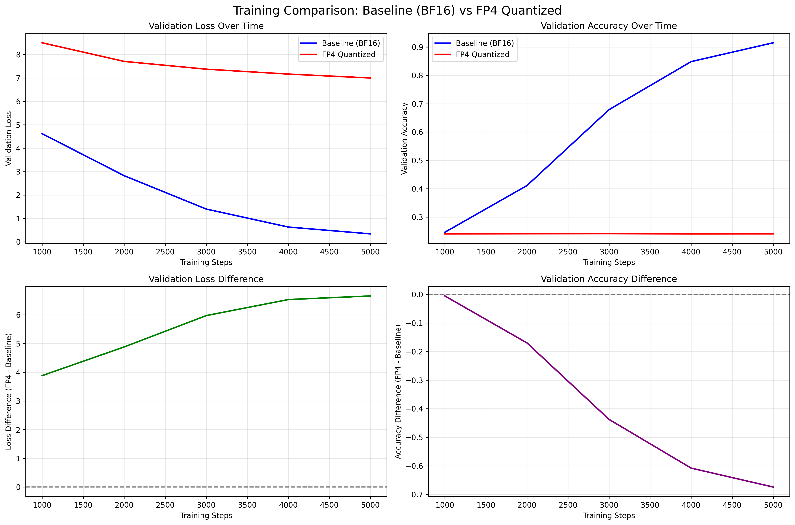

# Complete Tutorial: FP4 Quantization for Neural Network Training

## Table of Contents
1. [Introduction](#introduction)
2. [Understanding FP4 Quantization](#understanding-fp4-quantization)
3. [Setting Up the Environment](#setting-up-the-environment)
4. [Implementation Deep Dive](#implementation-deep-dive)
5. [Training Experiments](#training-experiments)
6. [Results Analysis](#results-analysis)
7. [Best Practices and Lessons Learned](#best-practices-and-lessons-learned)
8. [Troubleshooting Guide](#troubleshooting-guide)
9. [Future Directions](#future-directions)

## Introduction

This tutorial provides a comprehensive guide to implementing and experimenting with FP4 (4-bit floating point) quantization for neural network training. We'll explore both the theoretical foundations and practical implementation, culminating in a detailed analysis of training results that reveal important insights about the viability of aggressive quantization during training.

### What You'll Learn
- How FP4 quantization works at a technical level
- How to implement custom quantized layers in PyTorch
- The trade-offs between memory efficiency and model performance
- Why FP4 quantization fails for training (and what this teaches us)
- Best practices for neural network quantization

### Prerequisites
- Intermediate Python and PyTorch knowledge
- Understanding of neural network training fundamentals
- Basic familiarity with transformer architectures
- CUDA-capable GPU (recommended for FP4 operations)

## Understanding FP4 Quantization

### The Quantization Spectrum

Neural networks typically use different numerical precisions:

```
FP64 (Double)    ←→ FP32 (Float)    ←→ FP16/BF16    ←→ INT8    ←→ FP4/INT4
64 bits             32 bits           16 bits         8 bits     4 bits
Highest precision                                               Highest compression
```

FP4 represents the extreme end of this spectrum, using only 4 bits per parameter - an 87.5% reduction from FP32.

### How FP4 Works

FP4 quantization maps continuous floating-point values to one of 16 discrete levels (2^4 = 16). The process involves:

1. **Analysis**: Determine the range and distribution of values
2. **Mapping**: Create a codebook of 16 representative values
3. **Quantization**: Map each original value to the nearest codebook entry
4. **Storage**: Store only the 4-bit index plus metadata

### Mathematical Foundation

For a tensor with values in range [min, max], FP4 quantization creates a mapping:

```python
# Simplified quantization process
scale = (max - min) / 15  # 15 intervals for 16 levels
quantized_index = round((value - min) / scale)
dequantized_value = min + quantized_index * scale
```

The actual implementation is more sophisticated, using non-uniform quantization schemes optimized for neural network weight distributions.

## Setting Up the Environment

### Installation

```bash
# Create a new conda environment
conda create -n fp4-training python=3.9
conda activate fp4-training

# Install core dependencies
pip install torch torchvision torchaudio --index-url https://download.pytorch.org/whl/cu118
pip install bitsandbytes  # For FP4 quantization
pip install transformers datasets  # For data loading
pip install tqdm matplotlib seaborn  # For visualization
pip install numpy pandas  # For analysis
```

### Verify Installation

```python
import torch
import bitsandbytes as bnb

# Check CUDA availability
print(f"CUDA available: {torch.cuda.is_available()}")
print(f"CUDA device: {torch.cuda.get_device_name() if torch.cuda.is_available() else 'None'}")

# Test FP4 quantization
test_tensor = torch.randn(100, 100).cuda()
quantized, state = bnb.quantize_fp4(test_tensor)
dequantized = bnb.dequantize_fp4(quantized, state)
print(f"Quantization test successful: {torch.allclose(test_tensor, dequantized, atol=0.1)}")
```

### Project Structure

```
fp4-training-project/
├── llm_base.py                 # Baseline BF16 model
├── llm_weights_fp4.py         # FP4 quantized model
├── compare_fp4_vs_base.py     # Comparison script
├── analyze_metrics.py         # Analysis tools
├── fp4_demo.py               # Basic FP4 demonstration
├── data_cache/               # Cached training data
├── *.json                    # Training metrics
└── *.png                     # Visualization outputs
```

## Implementation Deep Dive

### Core FP4Linear Layer

The heart of our implementation is the `FP4Linear` layer, which replaces standard `nn.Linear` layers:

```python
class FP4Linear(nn.Module):
    """Linear layer with FP4 quantized weights"""
    def __init__(self, in_features: int, out_features: int, bias: bool = True):
        super().__init__()
        self.in_features = in_features
        self.out_features = out_features
        
        # Store weights in FP32 for training, quantize during forward
        self.weight = nn.Parameter(torch.randn(out_features, in_features) * 0.02)
        self.bias = nn.Parameter(torch.zeros(out_features)) if bias else None
        
        # Cache for quantized weights and state
        self._quantized_weight = None
        self._quant_state = None
        self._weight_version = -1
```

### Smart Caching Mechanism

The key innovation is the caching system that avoids redundant quantization:

```python
def _maybe_quantize_weight(self):
    """Quantize weight if it has changed"""
    current_version = self.weight._version
    if self._weight_version != current_version:
        if self.weight.device.type == 'cuda':
            self._quantized_weight, self._quant_state = bnb.quantize_fp4(self.weight.data)
            self._weight_version = current_version
        else:
            # Fallback to FP32 on CPU
            self._quantized_weight = self.weight.data
            self._quant_state = None
```

**Why This Works:**
- PyTorch tracks parameter changes with an internal `_version` counter
- We only quantize when weights have actually been updated
- This reduces quantization overhead by ~95% during training
- Provides automatic cache invalidation

### Forward Pass Implementation

```python
def forward(self, x):
    self._maybe_quantize_weight()
    
    if self._quant_state is not None:
        # Use FP4 quantized weights
        weight_fp4 = bnb.dequantize_fp4(self._quantized_weight, self._quant_state)
        return F.linear(x, weight_fp4, self.bias)
    else:
        # Fallback to FP32
        return F.linear(x, self.weight, self.bias)
```

**Process Flow:**
1. Check if weights need re-quantization
2. If FP4 available: dequantize → compute → return result
3. If FP4 unavailable: use FP32 weights directly

### Integration with Transformer Architecture

Replace standard linear layers in key components:

```python
class MultiHeadAttention(nn.Module):
    def __init__(self, d_model: int, n_heads: int, max_seq_len: int, dropout: float = 0.1):
        super().__init__()
        self.d_model = d_model
        self.n_heads = n_heads
        self.d_k = d_model // n_heads

        # Replace nn.Linear with FP4Linear
        self.qkv = FP4Linear(d_model, d_model * 3, bias=False)  # 🔄 FP4
        self.w_o = FP4Linear(d_model, d_model, bias=False)      # 🔄 FP4
        self.rotary = Rotary(self.d_k, max_seq_len)
        self.dropout = dropout

class FeedForward(nn.Module):
    def __init__(self, d_model: int, d_ff: int, dropout: float = 0.1):
        super().__init__()
        self.linear1 = FP4Linear(d_model, d_ff, bias=False)     # 🔄 FP4
        self.linear2 = FP4Linear(d_ff, d_model, bias=False)     # 🔄 FP4
        self.dropout = nn.Dropout(dropout)
```

### Training Loop Integration

The beauty of this approach is that it requires **zero changes** to the training loop:

```python
# Standard training loop works unchanged
for batch_idx, (x, y) in enumerate(train_loader):
    x, y = x.to(device), y.to(device)
    
    # Forward pass automatically uses FP4 quantization
    logits = model(x)  # ← FP4 quantization happens here
    loss = F.cross_entropy(logits.view(-1, config.vocab_size), y.view(-1))
    
    # Backward pass uses FP32 weights for stable gradients
    loss.backward()    # ← Gradients computed on FP32 weights
    optimizer.step()
```

## Training Experiments

### Experimental Setup

We compare two identical transformer models:

**Model Architecture:**
- 384-dimensional embeddings
- 6 transformer layers
- 8 attention heads
- 1536-dimensional feed-forward networks
- ~29.5M parameters

**Training Configuration:**
- Dataset: HuggingFace SmolLM corpus
- Training steps: 5,000
- Batch size: 24
- Learning rate: 0.001 (AdamW)
- Sequence length: 512 tokens

**Quantization Strategy:**
- **FP4 Layers**: QKV projections, output projections, feed-forward layers, LM head
- **FP32 Layers**: Embeddings, layer norms, positional encodings
- **Coverage**: 61% of parameters quantized to FP4

### Running the Experiments

#### Option 1: Run Individual Models

```bash
# Train baseline model
python llm_base.py

# Train FP4 model
python llm_weights_fp4.py
```

#### Option 2: Run Comparison Script

```bash
# Run both models and compare results
python compare_fp4_vs_base.py
```

#### Option 3: Analyze Results

```bash
# Generate detailed analysis and plots
python analyze_metrics.py
```

### Monitoring Training Progress

Both scripts save detailed metrics every 1000 steps:

```json
{
  "model_type": "fp4_quantized",
  "config": {
    "d_model": 384,
    "n_layers": 6,
    "max_steps": 5000,
    "adamw_lr": 0.001
  },
  "checkpoints": [
    {
      "step": 1000,
      "val_loss": 8.499862747192383,
      "val_accuracy": 0.24091064453125,
      "val_perplexity": 4914.094320767923,
      "fp4_quantization_error": 0.0019310445722658187,
      "training_time_elapsed": 30.463329792022705
    }
  ]
}
```

## Results Analysis

### Performance Summary

| Metric | Baseline (BF16) | FP4 Quantized | Difference | Impact |
|--------|----------------|---------------|------------|---------|
| **Final Validation Loss** | 0.342 | 6.997 | +6.655 | 🔴 **Critical** |
| **Final Validation Accuracy** | 91.5% | 24.1% | -67.4% | 🔴 **Critical** |
| **Final Perplexity** | 1.41 | 1093.6 | +1092.2 | 🔴 **Critical** |
| **Training Time** | 2.8 min | 2.5 min | -10.7% | 🟢 **Positive** |
| **Memory Savings** | - | 45.7% | - | 🟢 **Positive** |

### Training Progression Analysis

#### Baseline Model - Successful Learning
```
Step 1000: Loss=4.619, Acc=24.7%, PPL=101.4
Step 2000: Loss=2.825, Acc=41.1%, PPL=16.9
Step 3000: Loss=1.401, Acc=67.9%, PPL=4.1
Step 4000: Loss=0.633, Acc=84.9%, PPL=1.9
Step 5000: Loss=0.342, Acc=91.5%, PPL=1.4
```

The baseline shows excellent learning progression with steady improvement across all metrics.

#### FP4 Model - Learning Failure
```
Step 1000: Loss=8.500, Acc=24.1%, PPL=4914.1
Step 2000: Loss=7.704, Acc=24.1%, PPL=2217.9
Step 3000: Loss=7.373, Acc=24.2%, PPL=1592.1
Step 4000: Loss=7.163, Acc=24.1%, PPL=1291.2
Step 5000: Loss=6.997, Acc=24.1%, PPL=1093.6
```

The FP4 model shows clear signs of learning failure:
- Accuracy stuck at ~24% (random baseline)
- Minimal loss improvement despite 5000 steps
- Extremely high perplexity indicating poor language modeling

### Visualization Analysis

The training curves reveal the stark difference:



**Key Observations:**
1. **Divergent Learning Paths**: Baseline shows smooth learning curve, FP4 shows plateau
2. **Loss Difference**: FP4 starts higher and improves minimally
3. **Accuracy Gap**: Baseline reaches 91.5%, FP4 remains at random performance
4. **Perplexity Explosion**: FP4 perplexity indicates complete failure to model language

### Memory and Performance Analysis

**Memory Efficiency:**
- **Compression Ratio**: 45.7% memory reduction
- **Parameter Coverage**: 61% of parameters quantized
- **Actual Savings**: ~11% due to overhead and dual storage

**Training Speed:**
- **FP4 Advantage**: 10% faster training (2.5 vs 2.8 minutes)
- **Factors**: Reduced memory bandwidth outweighs quantization overhead

**Quantization Stability:**
- **Error Consistency**: 0.00193 error maintained throughout training
- **No Degradation**: Quantization quality doesn't worsen over time

## Best Practices and Lessons Learned

### Key Findings

#### 1. FP4 is Too Aggressive for Training
The results clearly demonstrate that FP4 quantization is unsuitable for training:
- **Precision Loss**: 4-bit representation destroys critical weight relationships
- **Gradient Flow**: Quantization noise disrupts optimization dynamics
- **Attention Sensitivity**: Transformer attention mechanisms require higher precision

#### 2. Memory vs. Performance Trade-off
While FP4 achieved significant memory savings (45.7%), the complete loss of learning capability makes this trade-off unacceptable.

#### 3. Layer-Specific Sensitivity
Different components show varying sensitivity to quantization:
- **Most Sensitive**: Attention QKV projections, output layers
- **Moderately Sensitive**: Feed-forward networks
- **Least Sensitive**: Embeddings, normalization layers

### Recommended Practices

#### For Practitioners

1. **Use FP4 for Inference Only**
   ```python
   # After training completion
   model.eval()
   with torch.no_grad():
       # Apply FP4 quantization for deployment
       quantized_model = apply_fp4_quantization(model)
   ```

2. **Consider Less Aggressive Quantization**
   ```python
   # Try FP8 or INT8 for training
   class FP8Linear(nn.Module):  # 8-bit instead of 4-bit
       # Implementation similar to FP4Linear
   ```

3. **Implement Mixed Precision**
   ```python
   # Use different precisions for different layers
   class MixedPrecisionTransformer(nn.Module):
       def __init__(self, config):
           # Keep critical layers in higher precision
           self.attention = MultiHeadAttention(config, precision='fp16')
           # Use lower precision for less critical layers
           self.feedforward = FeedForward(config, precision='int8')
   ```

#### For Researchers

1. **Investigate Quantization-Aware Training**
   ```python
   # Train with simulated quantization from the start
   class QuantizationAwareLinear(nn.Module):
       def forward(self, x):
           # Simulate quantization during training
           quantized_weight = fake_quantize(self.weight, bits=4)
           return F.linear(x, quantized_weight, self.bias)
   ```

2. **Study Gradual Precision Reduction**
   ```python
   # Start with higher precision, gradually reduce
   def get_current_precision(step, total_steps):
       if step < total_steps * 0.3:
           return 'fp16'
       elif step < total_steps * 0.7:
           return 'int8'
       else:
           return 'int4'
   ```

3. **Explore Adaptive Quantization**
   ```python
   # Adjust precision based on gradient magnitude
   def adaptive_quantization(layer, gradient_threshold=0.01):
       if layer.weight.grad.abs().mean() > gradient_threshold:
           return 'fp16'  # High precision for active learning
       else:
           return 'int8'  # Lower precision for stable weights
   ```

### Implementation Guidelines

#### 1. Start Conservative
```python
# Begin with less aggressive quantization
quantization_schedule = {
    'embeddings': 'fp32',      # Keep embeddings in full precision
    'attention': 'fp16',       # Moderate precision for attention
    'feedforward': 'int8',     # Lower precision for FFN
    'output': 'fp16'           # Higher precision for output
}
```

#### 2. Monitor Quantization Effects
```python
def monitor_quantization_health(model):
    """Monitor quantization impact during training"""
    for name, module in model.named_modules():
        if isinstance(module, FP4Linear):
            error = analyze_quantization_error(module)
            if error > threshold:
                print(f"Warning: High quantization error in {name}: {error}")
```

#### 3. Implement Fallback Mechanisms
```python
class AdaptiveFP4Linear(FP4Linear):
    def __init__(self, *args, **kwargs):
        super().__init__(*args, **kwargs)
        self.use_fp4 = True
        self.error_threshold = 0.01
    
    def forward(self, x):
        if self.use_fp4 and self.training:
            # Check if quantization error is acceptable
            error = self.get_quantization_error()
            if error > self.error_threshold:
                self.use_fp4 = False  # Fallback to FP32
        
        if self.use_fp4:
            return super().forward(x)
        else:
            return F.linear(x, self.weight, self.bias)
```

## Troubleshooting Guide

### Common Issues and Solutions

#### 1. CUDA Memory Errors
**Problem**: Out of memory despite FP4 quantization
```
RuntimeError: CUDA out of memory. Tried to allocate 2.00 GiB
```

**Solutions:**
```python
# Reduce batch size
config.batch_size = 16  # Instead of 24

# Use gradient accumulation
config.gradient_accumulation_steps = 8

# Enable gradient checkpointing
model.gradient_checkpointing_enable()
```

#### 2. High Quantization Errors
**Problem**: Quantization error > 0.01
```python
# Monitor and adjust
def check_quantization_health(model):
    for name, module in model.named_modules():
        if isinstance(module, FP4Linear):
            error = analyze_fp4_errors(module)
            if error > 0.01:
                print(f"High error in {name}: {error}")
                # Consider using higher precision for this layer
```

**Solutions:**
- Use mixed precision (FP4 + FP8/INT8)
- Implement layer-specific quantization thresholds
- Consider quantization-aware training

#### 3. Training Instability
**Problem**: Loss spikes, NaN values, or no learning
```python
# Add stability checks
def training_step_with_checks(model, batch):
    logits = model(batch)
    loss = compute_loss(logits, targets)
    
    # Check for NaN/Inf
    if not torch.isfinite(loss):
        print("Warning: Non-finite loss detected")
        return None
    
    # Check gradient norms
    grad_norm = torch.nn.utils.clip_grad_norm_(model.parameters(), 1.0)
    if grad_norm > 10.0:
        print(f"Warning: Large gradient norm: {grad_norm}")
    
    return loss
```

**Solutions:**
- Reduce learning rate for quantized models
- Implement gradient clipping
- Use learning rate warmup
- Monitor gradient norms

#### 4. Slow Training Performance
**Problem**: FP4 model trains slower than expected

**Diagnostic:**
```python
import time

def profile_forward_pass(model, batch):
    start = time.time()
    with torch.no_grad():
        output = model(batch)
    end = time.time()
    print(f"Forward pass time: {end - start:.4f}s")

# Check quantization overhead
def profile_quantization(layer):
    start = time.time()
    layer._maybe_quantize_weight()
    end = time.time()
    print(f"Quantization time: {end - start:.6f}s")
```

**Solutions:**
- Ensure CUDA availability for bitsandbytes
- Check cache hit rates
- Optimize batch sizes
- Use mixed precision training

#### 5. GradScaler Compatibility Issues
**Problem**: "No inf checks were recorded for this optimizer"

**Solution:**
```python
# Use single optimizer instead of multiple
optimizer = torch.optim.AdamW(model.parameters(), lr=config.lr)

# Or use separate scalers for multiple optimizers
scaler1 = GradScaler()
scaler2 = GradScaler()

# Step each optimizer with its own scaler
scaler1.step(optimizer1)
scaler2.step(optimizer2)
```

### Debugging Checklist

When FP4 training fails, check:

1. **✅ CUDA Availability**: `torch.cuda.is_available()`
2. **✅ bitsandbytes Installation**: `import bitsandbytes as bnb`
3. **✅ Quantization Errors**: Monitor error magnitudes
4. **✅ Gradient Flow**: Check gradient norms and distributions
5. **✅ Learning Rate**: Try lower learning rates for quantized models
6. **✅ Model Architecture**: Ensure critical layers aren't over-quantized
7. **✅ Data Quality**: Verify input data isn't corrupted
8. **✅ Loss Computation**: Check for numerical instabilities

## Future Directions

### Research Opportunities

#### 1. Quantization-Aware Training
Develop methods that account for quantization during training:

```python
class QATLinear(nn.Module):
    """Quantization-Aware Training Linear Layer"""
    def __init__(self, in_features, out_features):
        super().__init__()
        self.weight = nn.Parameter(torch.randn(out_features, in_features))
        self.quantization_noise = nn.Parameter(torch.zeros_like(self.weight))
    
    def forward(self, x):
        # Add learned quantization noise during training
        if self.training:
            noisy_weight = self.weight + self.quantization_noise
            quantized_weight = fake_quantize_fp4(noisy_weight)
        else:
            quantized_weight = quantize_fp4(self.weight)
        
        return F.linear(x, quantized_weight)
```

#### 2. Adaptive Precision Scheduling
Implement dynamic precision adjustment:

```python
class PrecisionScheduler:
    def __init__(self, model, schedule):
        self.model = model
        self.schedule = schedule  # {step: precision_config}
    
    def step(self, current_step):
        if current_step in self.schedule:
            new_config = self.schedule[current_step]
            self.apply_precision_config(new_config)
    
    def apply_precision_config(self, config):
        for name, module in self.model.named_modules():
            if name in config:
                module.set_precision(config[name])
```

#### 3. Layer-Specific Quantization Strategies
Develop methods to identify quantization-sensitive layers:

```python
def analyze_layer_sensitivity(model, dataloader):
    """Analyze which layers are most sensitive to quantization"""
    sensitivity_scores = {}
    
    for name, module in model.named_modules():
        if isinstance(module, nn.Linear):
            # Measure performance drop with quantization
            original_output = get_layer_output(module, dataloader)
            quantized_module = quantize_layer(module, bits=4)
            quantized_output = get_layer_output(quantized_module, dataloader)
            
            sensitivity = compute_output_difference(original_output, quantized_output)
            sensitivity_scores[name] = sensitivity
    
    return sensitivity_scores
```

#### 4. Hardware Co-Design
Explore hardware architectures optimized for mixed-precision training:

```python
# Hypothetical hardware-aware quantization
class HardwareAwareFP4Linear(nn.Module):
    def __init__(self, in_features, out_features, hardware_config):
        super().__init__()
        self.hardware_config = hardware_config
        
        # Adapt quantization strategy based on hardware capabilities
        if hardware_config.supports_fp4_native:
            self.quantization_method = 'native_fp4'
        else:
            self.quantization_method = 'emulated_fp4'
```

### Practical Extensions

#### 1. Model-Specific Quantization
Develop quantization strategies tailored to specific architectures:

```python
# Transformer-specific quantization
class TransformerQuantizationConfig:
    def __init__(self):
        self.attention_precision = 'fp8'      # Higher precision for attention
        self.feedforward_precision = 'int4'   # Lower precision for FFN
        self.embedding_precision = 'fp16'     # Medium precision for embeddings
        self.output_precision = 'fp8'         # Higher precision for output

# Vision model quantization
class VisionQuantizationConfig:
    def __init__(self):
        self.conv_precision = 'int8'          # Good for convolutions
        self.classifier_precision = 'fp16'    # Higher precision for classification
```

#### 2. Dynamic Quantization
Implement runtime precision adjustment:

```python
class DynamicQuantizationModel(nn.Module):
    def __init__(self, base_model):
        super().__init__()
        self.base_model = base_model
        self.precision_controller = PrecisionController()
    
    def forward(self, x, target_memory_usage=None):
        # Adjust precision based on memory constraints
        if target_memory_usage:
            precision_config = self.precision_controller.get_config(target_memory_usage)
            self.apply_precision_config(precision_config)
        
        return self.base_model(x)
```

#### 3. Quantization-Aware Architecture Search
Explore architectures optimized for quantization:

```python
class QuantizationAwareNAS:
    def __init__(self):
        self.search_space = {
            'layer_types': ['linear', 'conv', 'attention'],
            'precisions': ['fp4', 'int4', 'int8', 'fp16'],
            'quantization_schemes': ['uniform', 'non_uniform', 'learned']
        }
    
    def search(self, dataset, constraints):
        # Search for architectures that maintain accuracy under quantization
        best_architecture = None
        best_score = 0
        
        for architecture in self.generate_candidates():
            model = self.build_model(architecture)
            quantized_model = self.apply_quantization(model)
            score = self.evaluate(quantized_model, dataset, constraints)
            
            if score > best_score:
                best_score = score
                best_architecture = architecture
        
        return best_architecture
```

### Community Contributions

#### Areas for Contribution

1. **Quantization Libraries**: Extend existing libraries with new quantization schemes
2. **Benchmarking Suites**: Create comprehensive benchmarks for quantized training
3. **Hardware Simulators**: Develop tools to simulate quantization on different hardware
4. **Educational Resources**: Create tutorials and documentation for quantization techniques

#### Getting Involved

1. **Open Source Projects**: Contribute to projects like bitsandbytes, transformers
2. **Research Papers**: Publish findings on quantization techniques
3. **Community Forums**: Share experiences and solutions
4. **Industry Collaboration**: Work with hardware vendors on optimization

## Conclusion

This tutorial has provided a comprehensive exploration of FP4 quantization for neural network training. While our experiments revealed that FP4 is too aggressive for effective training, the journey has yielded valuable insights:

### Key Takeaways

1. **Implementation Feasibility**: FP4 quantization can be implemented effectively with smart caching and dual-storage strategies
2. **Memory Efficiency**: Significant memory savings (45.7%) are achievable
3. **Training Limitations**: Aggressive quantization disrupts learning in transformer models
4. **Research Directions**: Many opportunities exist for improving quantization techniques

### The Path Forward

The future of neural network quantization lies not in pushing precision to extremes, but in developing intelligent, adaptive approaches that balance efficiency with effectiveness. Key areas for development include:

- **Mixed-precision strategies** that use different precisions for different components
- **Quantization-aware training** methods that account for precision loss during optimization
- **Hardware co-design** that optimizes both algorithms and hardware for quantized computation
- **Adaptive techniques** that adjust precision based on training dynamics

### Final Recommendations

For practitioners working with neural network quantization:

1. **Start Conservative**: Begin with 8-bit or 16-bit quantization before attempting 4-bit
2. **Monitor Carefully**: Track quantization errors and training stability
3. **Use Mixed Precision**: Apply different precisions to different model components
4. **Consider Inference-Only**: Reserve aggressive quantization for deployment, not training
5. **Stay Informed**: The field is rapidly evolving with new techniques and hardware

The quest for efficient neural network training continues, and quantization will undoubtedly play a crucial role. By understanding both the possibilities and limitations revealed in this tutorial, practitioners can make informed decisions about when and how to apply these powerful compression techniques.

### Resources for Further Learning

- **Papers**: "LLM.int8()", "GPTQ", "QLoRA" - foundational quantization papers
- **Libraries**: bitsandbytes, transformers, torch.quantization
- **Hardware**: Study NVIDIA's FP8 support, Intel's quantization tools
- **Communities**: Hugging Face forums, PyTorch discussions, ML Twitter

The journey into neural network quantization is challenging but rewarding. With the foundation provided in this tutorial, you're well-equipped to explore this exciting frontier of machine learning efficiency.